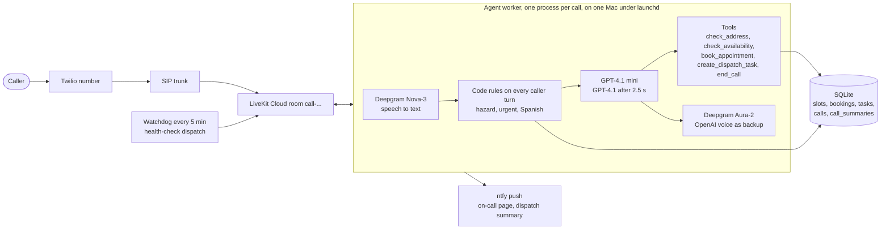

# Summit Air Voice Agent

An inbound AI phone agent for Summit Air, a fictional 40-technician HVAC company in Manhattan,
Brooklyn and Queens: it answers, works out what the caller needs, separates routine from urgent from
a genuine emergency, and either books a real appointment or files a dispatch task with a stated
callback target.

## Call +1 914-537-8567

Any address in Manhattan, Brooklyn or Queens can be booked, for example 14 Maple Street, Brooklyn,
11225. Five things to try:

| Say | What should happen | Tested on |
|---|---|---|
| "My furnace won't turn on." Then a name and an address when asked | The address is read back with the town; two windows are offered right after you confirm it; the booking is confirmed only after it is written, with the reference said digit by digit ("one oh oh five") | Phone, except the windows offered with the address (simulation only) |
| "My heat went out and my mother is 80, she lives with me." | Code files an urgent task on your first sentence, and the agent says the callback target before asking your name | Phone (Gate 2 call 1) |
| "I think gas is leaking from my stove." Then "Yes." | A fixed safety script, then a fixed closing line ("Get everyone outside now and call 911..."), and the agent hangs up. One emergency task, one page to the on-call phone | Phone (Gate 2 call 3) |
| "My furnace won't turn on. And no, I don't smell gas." | No safety script: the negation is understood and the call goes on as a routine booking | Phone (Gate 2 call 2), the booking in simulation |
| "Hello?", then "I want central AC installed." | A neutral "What can we help you with?", then a free estimate visit booked with no fee quoted | Simulation only |

Each finished call pushes a one-line summary to dispatch; an urgent or emergency call also pages the
on-call phone. During the review both go to the builder's phone.

## Architecture



Tools run inside the agent process, so no public endpoint can create or change a booking. Detail:
[`docs/architecture.md`](docs/architecture.md). Decisions and what would reverse them:
[`docs/decisions.md`](docs/decisions.md).

## What code guarantees, and what the model decides

The model runs the conversation. It does not get to decide what is true about the calendar, and it
does not get to decide whether a hazard or an at-risk caller gets help.

| Code guarantees | The model decides |
|---|---|
| A booking is confirmed only after the write returns a reference; one visit per call (a retry or a new window moves it, a second address is refused) | What the caller needs, what to ask next, and every sentence except the fixed lines |
| No booking without a window offered on this call, a checked in-area ZIP, a street name and the caller's name | Softer urgency the keyword rules can't see, such as "it's dangerous for her" |
| Gas, carbon monoxide or smoke: the task, the safety script and the closing line, with "I don't smell gas" read as a no and the page held until a clear no or 15 s | When a caller wants a booking moved, and to which window |
| No heat or cooling plus someone at risk: an urgent task filed on that turn, before any booking, and the booking marked priority | Most off-script calls: a refused address, plumbing, "where's my tech?", a prompt injection |
| A Spanish opening gets a fixed Spanish line and a callback task, never a promised Spanish speaker | |
| A model or speech failure gets a fixed line, a callback task with the transcript, and a hang-up | |
| A call that hangs up after naming a problem, with no booking or task, gets a callback task | |
| Callback targets count office hours; the goodbye is fixed; end_call waits for "anything else?" or a goodbye | |

## Evaluation

<!-- eval:start -->
**57/57 simulated calls passed** on commit `6cd8ef5` (gpt-4.1-mini, 2 run(s) on safety and adversarial, 1 run(s) on core, per scenario and clock). Generated by `uv run python -m evals`; detail and failures in [`evals/REPORT.md`](evals/REPORT.md).

| Category | Baseline | Final |
|---|---|---|
| safety | 8/8 | 16/16 |
| core | 14/14 | 11/11 |
| adversarial | 6/6 | 30/30 |

Baseline: `2026-09-27-1935-7b5525e-rescored.json`, 11 scenarios before the Phase 2 changes, graded by the checks of that time. Several checks are stricter now, so a baseline pass is not a pass today. A dash means the scenario did not exist yet.

<details><summary>Every scenario</summary>

| Scenario | Category | Clock | Baseline | Final |
|---|---|---|---|---|
| gas | safety | demo | 2/2 | 2/2 |
| gas | safety | night | 2/2 | 2/2 |
| elderly_no_heat | safety | demo | 2/2 | 2/2 |
| elderly_no_heat | safety | night | 2/2 | 2/2 |
| infant_no_heat | safety | demo | - | 2/2 |
| infant_no_heat | safety | night | - | 2/2 |
| ac_oxygen | safety | demo | - | 2/2 |
| ac_oxygen | safety | night | - | 2/2 |
| blocked_id | core | demo | 2/2 | 1/1 |
| member | core | demo | 2/2 | 1/1 |
| no_show | core | demo | 2/2 | 1/1 |
| no_show | core | night | 2/2 | 1/1 |
| commercial | core | demo | 2/2 | 1/1 |
| address_change | core | demo | 2/2 | 1/1 |
| routine_furnace | core | demo | 2/2 | 1/1 |
| change_window | core | demo | - | 1/1 |
| abandoned | core | demo | - | 1/1 |
| relative_address | core | demo | - | 1/1 |
| new_install | core | demo | - | 1/1 |
| price_robot | adversarial | demo | 2/2 | 2/2 |
| spanish | adversarial | demo | 2/2 | 2/2 |
| risk_during_readback | adversarial | demo | - | 2/2 |
| risk_during_readback | adversarial | night | - | 2/2 |
| two_issues | adversarial | demo | - | 2/2 |
| asr_street | adversarial | demo | - | 2/2 |
| no_gas_negation | adversarial | demo | - | 2/2 |
| dusty_smell | adversarial | demo | - | 2/2 |
| stray_word | adversarial | demo | 2/2 | 2/2 |
| wrong_number | adversarial | demo | - | 2/2 |
| refuses_address | adversarial | demo | - | 2/2 |
| status_call | adversarial | demo | - | 2/2 |
| plumbing | adversarial | demo | - | 2/2 |
| abusive_human | adversarial | demo | - | 2/2 |
| injection | adversarial | demo | - | 2/2 |

</details>
<!-- eval:end -->

- **Simulated calls** (`uv run python -m evals`): a caller played by a model or by scripted lines,
  against the real prompt, tools and store, on two fixed clocks (Tuesday 12:35 PM with the office
  open, Monday 9 PM with it closed). Checks read the database and the transcript. There is no model
  judge. Every run is priced and written to a spend ledger, [`evals/spend.json`](evals/spend.json).
- **`uv run pytest`**: 286 offline tests, no credentials, no cost: the store, the booking guards,
  the hazard, urgent and Spanish rules with the phrases that must not trigger them, the held page,
  the failure ladder, the call record, and prompt rendering.
- **`uv run pytest -m llm --fallback`**: 5 older tests with a model judge, run once at the end on
  both models, the only check of GPT-4.1 as the fallback. 6 of 10 passed (GPT-4.1 mini 2 of 5,
  GPT-4.1 4 of 5), and the failures are reported, not fixed, because behavior was frozen. Two are
  real: GPT-4.1 mini, on the real clock at night, told a no-heat caller who hadn't mentioned anyone
  at risk that on-call was notified; and after a callback promise it asked "What can we help you
  with in the meantime?". Two are the tests: GPT-4.1 didn't file the urgent task because code
  already had, and GPT-4.1 mini offered the windows but asked for the address instead of whether
  they work. Detail in [`evals/REPORT.md`](evals/REPORT.md).
- **Phone calls**: every one is graded in [`docs/scenarios.md`](docs/scenarios.md) with its room.

**What the phone has proven and what it hasn't.** Routine booking, urgent filed by code, the gas
script with its closing line and hang-up, the gas negation and the street-name check were proven
on phone calls. These have been proven only in simulation and offline tests, never on a phone call:
the abandoned-call callback, the wrong-number exit, the refused address, the Spanish line, the
dispatch push, the new-install estimate, the failure ladder, and the windows offered with the
address.

## Skipped, and why

- **Live transfer.** The only destination is one cell phone, and an unanswered cell rolls to
  voicemail, which the phone network reports as answered. A callback task with a target is the
  honest version ([ADR-005](docs/decisions.md#adr-005-live-transfer-deferred)).
- **A full Spanish agent.** A second prompt and voice to test, for a line that gets a fixed Spanish
  answer and a callback instead.
- **SMS confirmation.** Sending from a US number needs A2P 10DLC registration, which takes weeks.
- **ServiceTitan.** The schedule lives in SQLite with real windows and capacity. Wiring the system of
  record is deployment work and doesn't change whether the conversation and booking logic are right.
- **Deepgram Flux** (end-of-turn inside speech to text). A speech-path change can't be proven in text
  simulations, and it would have needed its own round of phone calls.
- **A model judge.** Checks read the database and the transcript, so a pass means the row exists,
  not that another model liked the wording.
- **A speech-to-text backup.** Wrapping Deepgram in a fallback adapter drops its word-aligned
  transcripts on every normal call, so Deepgram listens alone.

## Known limits

- **One host.** The worker and the database run on one Mac. If it loses power or network, the
  number stops answering; a watchdog pages when the worker stops taking health checks.
- **One OpenAI key.** Both models and the backup voice run on it, so an outage or an empty balance
  takes out all three. The failure ladder then ends the call with a callback.
- **Keyword detectors.** Hazard, urgent and Spanish detection are word lists. The gas negation is
  lexical ("it's not like there's no gas smell" reads as a no), and a chirping smoke detector matches.
- **Two bookings in one turn.** If the model sends two `book_appointment` calls in one turn, the store
  can end on a different window than the caller heard (change_window, 1 of 6 simulated runs).
- **Wording.** On a home replacement call the agent once asked "Who should the technician ask for?"
  as if it were a business (call `kaAJD7TK4HWb`).
- **Recognition.** Street names are misheard ("Bergen" as "Burger"), and nothing checks a street
  against a street list or a ZIP against a town.
- **Pushes carry no caller details**: the outcome, a first name, the ZIP and a lookup, never the
  number, the street or the caller's words. `scripts/calls.py` has the rest. `DISPATCH_NTFY_TOPIC` falls back to `NTFY_TOPIC`, so without it dispatch summaries
  and on-call pages share one topic.
- **Latency.** Replies ran 0.9 to 2.6 s end to end on the 2026-09-27 phone calls. When the turn
  detector thinks the caller is mid-sentence it waits up to 1.1 s, and up to 2.5 s after the agent
  asks for an address or a number.
- **Nobody is actually on call.** Pages reach one test phone, and callback targets are targets.

## What I'd do next with Summit Air

1. **ServiceTitan** as the system of record: real technicians, capacity and customer history, so a
   member or a repeat caller is recognized.
2. **A Spanish agent**, with its own prompt, voice and test calls, instead of a callback.
3. **SMS confirmation** once 10DLC registration clears.
4. **A street-list check** against the territory's streets and ZIPs, to catch misheard addresses
   before they are booked.
5. **Measure booked-and-kept jobs**, not calls answered: did the visit happen, and did the urgent
   callback land inside its target.

## Running it

Needs Python 3.11 or later, [uv](https://docs.astral.sh/uv/), a LiveKit Cloud project, OpenAI and
Deepgram keys, and for phone calls a Twilio number on an Elastic SIP trunk into a LiveKit inbound
trunk.

```sh
uv sync
uv run pytest                     # offline, no keys needed
cp .env.example .env.local        # then fill in the keys
uv run python src/agent.py download-files
uv run python src/agent.py start  # the worker; refuses to start without its keys
```

Route calls to it with `lk sip dispatch create telephony/dispatch-rule.json`: each call gets a room
named `call-...`, and that name keys the call's rows in the database. On the demo host the worker
runs under launchd with a 5-minute watchdog ([`ops/launchd/`](ops/launchd/README.md)).

```sh
uv run python -m evals --dry-run          # the simulated-call plan and its cost; drop --dry-run to spend
uv run python scripts/calls.py            # recent calls; add a call ID or a reference for one call sheet
uv run python scripts/watchdog.py --dry-run
```
